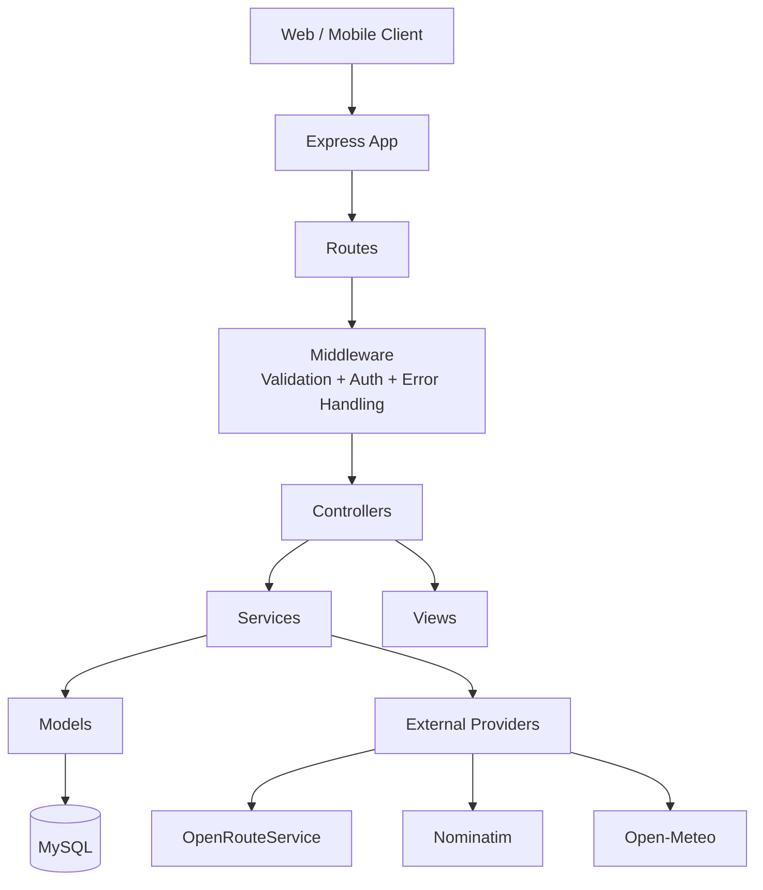
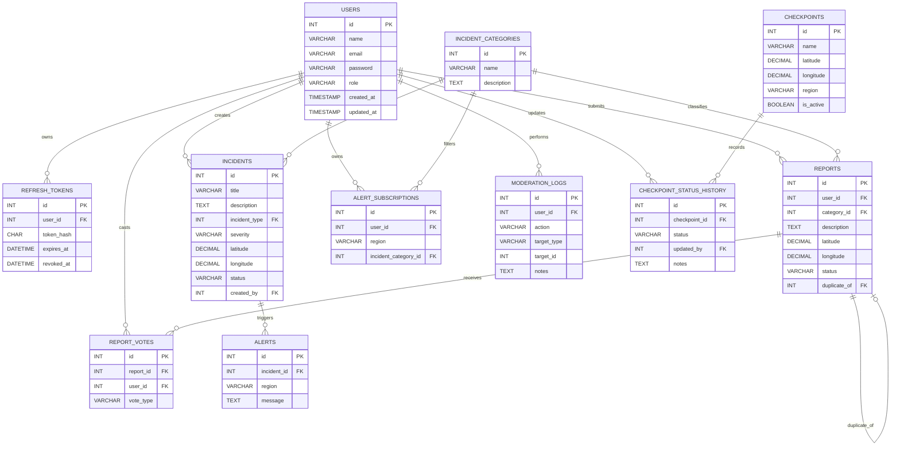

# Wasel Mobility Incident API

Node.js and Express REST API for a mobility incident platform. The service manages authentication, incidents, community reports, checkpoints, alerts, moderation records, and location-context enrichment from external providers.

## 1. Overview

### What the system does

- exposes a versioned REST API under `/api/v1`
- supports public read access for operational data such as incidents, checkpoints, and alerts
- supports authenticated write flows for reports, votes, subscriptions, and protected administration features
- stores core business data in MySQL
- enriches location requests with routing, reverse geocoding, and weather data

### Main capabilities

- JWT access tokens plus refresh-token rotation
- role-based authorization for `admin`, `moderator`, and `citizen`
- request validation before controller logic
- layered MVC-style backend with reusable CRUD services
- k6 performance test suite with generated HTML reporting

## 2. Architecture

### Architecture diagram



### Backend layering

- `server.js` boots Express, JSON parsing, route mounting, and global error handling.
- `src/routes/` defines the HTTP surface and attaches validation and auth middleware per endpoint.
- `src/controllers/` keeps request handlers thin and delegates work to services.
- `src/services/` contains business logic, including auth flows and external API orchestration.
- `src/models/` performs database access against MySQL using `mysql2/promise`.
- `src/views/` normalizes successful and error responses.
- `src/middleware/` handles request validation, bearer-token auth, authorization, and error normalization.

### Request flow

1. A client calls `/api/v1/...`.
2. Route-level middleware validates path params, query params, and JSON bodies.
3. Protected routes require `Authorization: Bearer <access-token>`.
4. Controllers call services.
5. Services perform business logic, database operations, and optional external-provider calls.
6. Views serialize the response in a consistent JSON shape.
7. Error middleware maps application and database errors to HTTP responses.

## 3. Project structure

```text
.
|-- performance-tests/
|   |-- helpers.js
|   |-- read-test.js
|   |-- write-test.js
|   |-- mixed-test.js
|   |-- spike-test.js
|   `-- soak-test.js
|-- reports/
|   |-- generate-report.js
|   |-- performance-suite-report.html
|   |-- baseline-*.json
|   `-- after-*.json
|-- src/
|   |-- config/
|   |-- controllers/
|   |-- errors/
|   |-- middleware/
|   |-- models/
|   |-- routes/
|   |-- services/
|   |-- utils/
|   |-- validators/
|   `-- views/
|-- schema.sql
|-- server.js
`-- README.md
```

## 4. Database schema

The database is a normalized relational schema centered on users, incidents, reports, checkpoints, and auditability.

### Key tables

- `users`: account records and role assignments
- `refresh_tokens`: hashed refresh tokens with expiry and revocation timestamps
- `incident_categories`: taxonomy used by incidents and reports
- `incidents`: official incident records
- `reports`: crowdsourced incident submissions
- `report_votes`: one vote per user per report
- `checkpoints`: known checkpoint locations
- `checkpoint_status_history`: status timeline for checkpoints
- `alert_subscriptions`: user subscriptions by region and optional category
- `alerts`: published alerts linked to regions or incidents
- `moderation_logs`: moderation audit trail

### ERD



### Schema design notes

- Foreign keys are used throughout for referential integrity.
- `ON DELETE CASCADE` is used where child rows should disappear with the parent, such as `refresh_tokens` and `report_votes`.
- `ON DELETE SET NULL` is used where historical records should remain even if a parent record is removed.
- Supporting indexes exist on common join and filter columns such as status fields, foreign keys, and `(report_id, user_id)` uniqueness for votes.

The full DDL lives in [`schema.sql`](schema.sql).

## 5. API design rationale

### Why this API shape

- The API is resource-oriented, which keeps routing predictable: `/incidents`, `/reports`, `/alerts`, `/checkpoints`, and so on.
- Everything is versioned under `/api/v1`, which avoids breaking clients when a later API version is introduced.
- Public-read and protected-write paths are separated at the route layer, which keeps authorization rules explicit.
- Validation happens before service execution, so malformed requests fail early and consistently.

### Why MVC plus services

- Controllers stay thin and mostly translate HTTP input into service calls.
- Services contain the logic that should not live in Express handlers, such as refresh-token rotation or external-provider aggregation.
- Models stay focused on data access and can be reused by multiple services.
- Views centralize response formatting instead of duplicating serialization logic in controllers.

### Authentication and authorization model

- Access tokens are JWTs that carry `sub`, `email`, and `role`.
- Refresh tokens are stored hashed in the database, not in plaintext.
- `authenticate` parses and verifies bearer tokens.
- `authorize(...roles)` enforces route-level role checks.
- Admin-only and moderator-only boundaries are declared directly in [`src/routes/index.js`](src/routes/index.js).

### Validation model

- `validateBody`, `validateQuery`, and `validateIdParam` are applied at route registration time.
- Payload schemas are declared centrally in [`src/validators/resourceSchemas.js`](src/validators/resourceSchemas.js).
- Enumerated fields such as role, severity, report status, and vote type are constrained before they reach the database.

### Error-handling model

- application errors use `AppError`
- duplicate-key database errors map to `409`
- invalid foreign-key relationships map to `400`
- unexpected server-side failures are hidden behind `500 Internal server error`

### API surface summary

| Area | Representative endpoints | Notes |
| --- | --- | --- |
| Auth | `POST /auth/register`, `POST /auth/login`, `POST /auth/refresh`, `POST /auth/logout` | refresh-token rotation |
| Users | `GET /users`, `POST /users` | admin-only management |
| Incidents | `GET /incidents`, `POST /incidents` | public reads, authenticated writes |
| Reports | `GET /reports`, `POST /reports` | write path binds report ownership to authenticated user |
| Checkpoints | `GET /checkpoints`, `POST /checkpoints` | admin and moderator write access |
| Alerts | `GET /alerts`, `POST /alerts` | moderation workflow |
| External | `GET /external/routes`, `GET /external/context` | provider-backed integration endpoints |

## 6. External API integration details

The service integrates with three external providers through a shared `ExternalApiClient` abstraction in [`src/services/externalIntegrationsService.js`](src/services/externalIntegrationsService.js).

### Provider summary

| Provider | Purpose | Platform endpoint | Authentication |
| --- | --- | --- | --- |
| OpenRouteService | route generation | `GET /api/v1/external/routes` | API key in `Authorization` header |
| Nominatim | reverse geocoding | used by `GET /api/v1/external/context` | `User-Agent` and optional `From` email header |
| Open-Meteo | current weather snapshot | used by `GET /api/v1/external/context` | no API key in current implementation |

### Integration behavior

- `GET /api/v1/external/routes`
  - required query params: `start_lat`, `start_lng`, `end_lat`, `end_lng`
  - optional query param: `profile`
  - allowed profiles: `driving-car`, `cycling-regular`, `foot-walking`
  - internally calls OpenRouteService `POST /v2/directions/{profile}`

- `GET /api/v1/external/context`
  - required query params: `latitude`, `longitude`
  - performs two upstream requests in parallel
  - combines reverse geocoding from Nominatim with current weather from Open-Meteo

### Reliability and protection mechanisms

- provider-specific timeout control via `AbortController`
- in-memory TTL caching via [`src/utils/memoryCache.js`](src/utils/memoryCache.js)
- fixed-window rate limiting with optional minimum inter-request delay via [`src/utils/fixedWindowRateLimiter.js`](src/utils/fixedWindowRateLimiter.js)
- normalized upstream failures mapped to `502`, `503`, or `504`
- startup-time config fallbacks for base URLs, timeouts, and cache settings

### External integration environment variables

```env
OPENROUTE_SERVICE_BASE_URL=https://api.openrouteservice.org
OPENROUTE_SERVICE_API_KEY=
OPENROUTE_SERVICE_TIMEOUT_MS=5000
OPENROUTE_SERVICE_CACHE_TTL_MS=300000
OPENROUTE_SERVICE_RATE_LIMIT_MAX_REQUESTS=40
OPENROUTE_SERVICE_RATE_LIMIT_WINDOW_MS=60000
OPENROUTE_SERVICE_MIN_INTERVAL_MS=250

NOMINATIM_BASE_URL=https://nominatim.openstreetmap.org
NOMINATIM_TIMEOUT_MS=5000
NOMINATIM_CACHE_TTL_MS=300000
NOMINATIM_RATE_LIMIT_MAX_REQUESTS=60
NOMINATIM_RATE_LIMIT_WINDOW_MS=60000
NOMINATIM_MIN_INTERVAL_MS=1000
NOMINATIM_USER_AGENT=WaselMobility/1.0
NOMINATIM_CONTACT_EMAIL=

OPEN_METEO_BASE_URL=https://api.open-meteo.com/v1
OPEN_METEO_TIMEOUT_MS=5000
OPEN_METEO_CACHE_TTL_MS=600000
OPEN_METEO_RATE_LIMIT_MAX_REQUESTS=60
OPEN_METEO_RATE_LIMIT_WINDOW_MS=60000
OPEN_METEO_MIN_INTERVAL_MS=250
```

## 7. Testing strategy

### Current state of testing in this repository

This repository contains a performance test suite and strong request-validation coverage in the runtime codebase, but it does **not** currently include a checked-in automated unit-test or integration-test suite such as Jest, Mocha, or Supertest.

### What is currently verified by the codebase

- request-body validation through centralized schema validators
- route-param validation for numeric IDs
- query validation for external endpoints
- authentication enforcement on protected endpoints
- authorization enforcement for admin and moderator operations
- database-level integrity through foreign keys, unique constraints, and indexes

### Performance testing approach

The checked-in k6 suite covers five workload types:

- `read-test.js`: read-heavy traffic against `GET /api/v1/incidents`
- `write-test.js`: write-heavy traffic against `POST /api/v1/reports`
- `mixed-test.js`: mixed read/write traffic with a configurable read ratio
- `spike-test.js`: abrupt concurrency ramp-up and ramp-down
- `soak-test.js`: sustained load over a longer window

### What each k6 script checks

- expected HTTP status codes
- JSON response content type
- latency thresholds per request type
- error-rate thresholds
- scenario-specific success counters and trends

### Recommended functional test matrix

To make the documentation complete and realistic, this is the next logical automated test plan for the codebase:

| Layer | What should be tested |
| --- | --- |
| Validators | schema acceptance and rejection cases for every resource |
| Auth service | register, login, refresh rotation, logout, logout-all |
| Protected routes | missing token, malformed token, wrong role |
| CRUD routes | happy path, missing record, invalid related resource, duplicate resource |
| External integrations | timeout handling, missing API key, upstream 401/403/429/non-2xx mapping |
| Error handling | database duplicate key, invalid FK, unknown route, unexpected exception |

## 8. Performance testing results

The latest checked-in "after" k6 artifacts were generated on **March 15, 2026** and stored in `reports/after-*.json`. The consolidated HTML report is [`reports/performance-suite-report.html`](reports/performance-suite-report.html).

### Consolidated results

| Metric | Result |
| --- | ---: |
| Average response time | 8.09 ms |
| p95 latency | 36.77 ms |
| Throughput | 15.90 req/s |
| Error rate | 0.00% |
| Total requests | 4,348 |
| HTTP duration samples | 4,348 |
| Observed combined duration | 273.48 s |

### Scenario breakdown

| Scenario | Source file | Avg response time | p95 latency | Throughput | Error rate |
| --- | --- | ---: | ---: | ---: | ---: |
| Read-heavy | `reports/after-read.json` | 2.89 ms | 4.09 ms | 8.73 req/s | 0.00% |
| Write-heavy | `reports/after-write.json` | 8.25 ms | 10.71 ms | 2.91 req/s | 0.00% |
| Mixed | `reports/after-mixed.json` | 4.30 ms | 10.17 ms | 8.36 req/s | 0.00% |
| Spike | `reports/after-spike.json` | 9.58 ms | 51.18 ms | 64.39 req/s | 0.00% |
| Soak | `reports/after-soak.json` | 4.05 ms | 10.51 ms | 4.85 req/s | 0.00% |

### Interpretation

- Read-heavy traffic is the fastest path, which is consistent with simple public GET access against indexed tables.
- Write-heavy traffic is slower because it includes authentication, validation, and inserts.
- Spike testing produced the highest tail latency, but still completed with a `0.00%` error rate.
- No artifact indicates request-level instability or correctness failures under the recorded workload.

### Baseline vs after comparison

The repository also contains baseline artifacts (`reports/baseline-*.json`). Comparing the combined baseline set to the combined after set:

| Metric | Baseline | After | Delta |
| --- | ---: | ---: | ---: |
| Average response time | 4.09 ms | 8.09 ms | +4.00 ms |
| p95 latency | 10.14 ms | 36.77 ms | +26.63 ms |
| Throughput | 15.25 req/s | 15.90 req/s | +0.64 req/s |
| Error rate | 0.00% | 0.00% | 0.00% |

### Limitations of these results

- The report is built from k6 request-level metrics only.
- There is no CPU, memory, database slow-query, or network telemetry in the repository.
- The artifacts do not prove domain correctness beyond status-code and JSON checks.
- The README cannot claim an optimization improvement because the checked-in "after" set has higher latency than the checked-in baseline set.

## 9. Setup and running

### Install

```bash
npm install
```

### Configure environment

There is a checked-in `.env` file in the repository root. At minimum, the application expects values like:

```env
PORT=3000
DB_HOST=127.0.0.1
DB_PORT=3306
DB_USER=root
DB_PASSWORD=
DB_NAME=wasel_mobility
JWT_SECRET=replace_me
JWT_EXPIRES_IN=1d
JWT_REFRESH_EXPIRES_IN_DAYS=30
```

### Create the database schema

```bash
mysql -u your_user -p your_database < schema.sql
```

### Start the API

```bash
npm run start
```

Development mode:

```bash
npm run dev
```

Default root URLs:

- `http://localhost:3000/`
- `http://localhost:3000/api/v1`

### Docker deployment

The application can be deployed with Docker and Docker Compose using the files in the repository root:

- [`Dockerfile`](Dockerfile)
- [`docker-compose.yml`](docker-compose.yml)

Start the API and MySQL together:

```bash
docker compose up --build
```

Run in detached mode:

```bash
docker compose up --build -d
```

Stop the stack:

```bash
docker compose down
```

Notes:

- the MySQL container initializes the schema automatically from `schema.sql`
- the app container connects to the database service using `DB_HOST=mysql`
- if `.env` leaves `DB_PASSWORD` empty, Compose falls back to `root`
- you can set `MYSQL_ROOT_PASSWORD` in your shell or `.env` before startup for a non-default root password

## 10. Running the performance suite

### Individual scenarios

```bash
k6 run performance-tests/read-test.js
k6 run performance-tests/write-test.js
k6 run performance-tests/mixed-test.js
k6 run performance-tests/spike-test.js
k6 run performance-tests/soak-test.js
```

Write-capable scenarios require an auth token:

```bash
k6 run -e AUTH_TOKEN=your_access_token performance-tests/write-test.js
```

### Export JSON artifacts

```bash
k6 run --out json=reports/after-read.json performance-tests/read-test.js
```

### Rebuild the HTML report

```bash
node reports/generate-report.js \
  --input "reports/after-read.json,reports/after-write.json,reports/after-mixed.json,reports/after-spike.json,reports/after-soak.json" \
  --baseline "reports/baseline-read.json,reports/baseline-write.json,reports/baseline-mixed.json,reports/baseline-spike.json,reports/baseline-soak.json" \
  --output reports/performance-suite-report.html \
  --title "Wasel Mobility Performance Suite" \
  --base-url "http://localhost:3000"
```

## 11. Documentation checklist

This README now includes all required items:

- architecture diagram
- database schema with ERD
- API design rationale
- external API integration details
- testing strategy
- performance testing results
